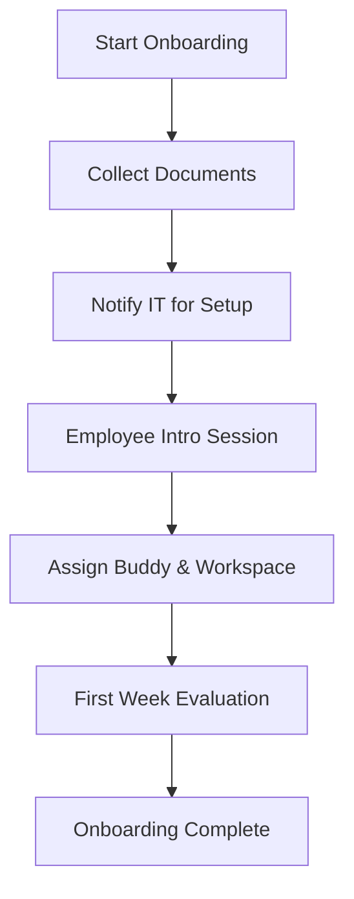

# HR Onboarding Process Diagram

```mermaid
flowchart TD
    Start[Start Onboarding] --> Docs[Collect Documents]
    Docs --> IT[Notify IT for Setup]
    IT --> Intro[Employee Intro Session]
    Intro --> Assign[Assign Buddy & Workspace]
    Assign --> Eval[First Week Evaluation]
    Eval --> Done[Onboarding Complete]
```
